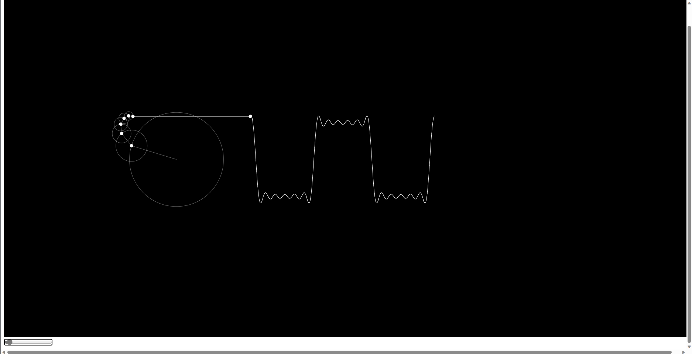

# Fourier series

## Author: Ammar Abul-Feilat

This is a simple implementation of the Fourier series. The code is written in JS and uses the following libraries:

- [p5.js](https://p5js.org/)

## Usage

The code is written in JS and can be run in any browser. To run the code, simply open the `index.html` file in your browser. The code can also be run using a local server

## Examples

The following are some examples of the output of the code:



**_Note:_** visualize a Fourier series for a square wave in JavaScript with p5.js , the equation for the Fourier series is given by:

```js
f(x)= 4/π ∑n=1,3,5...∞1n sin(nπx)
```

### References

- [Fourier series](https://en.wikipedia.org/wiki/Fourier_series)
- [3Blue1Brown](https://www.youtube.com/watch?v=r6sGWTCMz2k)
- [The Coding Train](https://www.youtube.com/watch?v=Mm2eYfj0SgA)
- [p5js.org](https://p5js.org/)
- [p5js editor](https://editor.p5js.org/)
